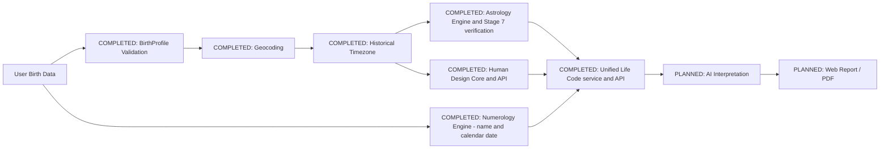

---
tags:
  - memory/architecture
---

# Architecture

Güncel sınırlar ve kaynak haritası için [[04_CURRENT_STATE]]; kararlar için [[05_DECISIONS]];
gerçek HTTP sınırları için [[06_API_CONTRACTS]]. Tarihsel başlangıç notu için
[architecture.md](architecture.md); timezone ayrıntıları için [[timezone]] ([GitHub link](timezone.md));
tasarım ayrıntıları için [[frontend-design]] ([GitHub link](frontend-design.md)).

| Layer | Technology | Status |
| --- | --- | --- |
| Frontend | Next.js, TypeScript, App Router, Tailwind | completed foundation |
| Backend | FastAPI, Python, Pydantic | completed foundation |
| Geocoding | Nominatim through backend service | completed |
| Timezone | timezonefinder, zoneinfo, tzdata | completed |
| Astrology | Swiss Ephemeris 2.10.03 / pyswisseph 2.10.3.2 | Stages 6–7 completed; scope: [[astrology-verification]] |
| Numerology | Pure Python / Pydantic, Pythagorean convention | Stage 8 completed; [[numerology]] |
| Human Design | Swiss/Moshier astronomy + deterministic graph/classification | Stage 9 backend/API completed; [[human-design]] |
| Unified Life Code | Frozen internal envelope + composed public engine schemas | Stages 10A/10B completed; [[life-code]] |
| Database | PostgreSQL | planned |
| AI | provider abstraction, Gemini/OpenAI candidates | planned |
| PDF | shared report JSON source | planned |

Frontend never calls a geocoding provider directly. The timezone layer takes resolved coordinates
and exact local time; the astrology service receives its UTC result and must not repeat
timezone resolution.
Numerology consumes name and calendar birth date directly, with an optional explicit target year;
it has no dependency on coordinates, geocoding or timezone resolution.

Unified Life Code receives already resolved UTC/coordinates alongside the original local calendar
date, name and optional explicit target year. It calls the three existing engines sequentially once,
without recalculation or field loss. Only Numerology receives name/calendar date/target year; only
Astrology receives coordinates. Name is not retained in the result. The frozen outer result preserves
original typed children; Astrology/Numerology children remain mutable (not a deep immutable snapshot).
The internal service has no HTTP surface, clock, provider, interpretation or persistence. ADR-016
and [[life-code]] define the boundary; engine conventions and native-state ownership are unchanged.
Stage 10B transport is complete: strict resolved input, one service call,
composed public schemas and shared standalone-HD safe projection. UTC admission uses an aware clock;
calendar admission preserves Numerology's server-local day policy. No new timezone resolution.

## Kamerî Kod boundary (Stages K0–K1B mechanical API)

ADR-017 and [[kameri-code]] define a future separate module, not a fourth member of the Stage 10
Life Code v1 response. Existing input resolution/native-state ownership is reused; new timezone,
geocoding and astronomy stacks are not planned. Source provenance and field classification separate
astronomy, calendar conversion, symbolic mappings and historical interpretation. Only five scoped
mechanical methods now have an isolated internal implementation; automatic spelling, proposed mansion
labels and interpretation are not production-ready. K1B exposes this scope through a separate
strict public transport; Stage 11 is NOT STARTED.

`backend/app/services/traditional/` contains frozen `models`, integer `hijri`, allowlisted `abjad`,
`lunar` astronomy/mappings, `planetary_hours` and small private `_astronomy` adapters. Existing
Astrology/HD inline their UTC-to-JD calls; K1A wraps the same Swiss operation without changing
them. The existing Astrology RLock/initializer and timezone `load_zone` remain the shared owners.
No existing engine is refactored. Moon positions/phenomena use TT; solar events/membership use
UT1; only planetary-day date ownership projects R0 through pinned IANA data. Native root searches
alternate rise/set/rise, without epsilon stepping. See [[kameri-verification]] for scoped evidence.

`POST /api/v1/kameri/calculate` is a thin admission/projection boundary over those four K1A entry
points (the lunar result owns its mansion). It accepts resolved local date, UTC instant, coordinates,
IANA timezone and explicitly confirmed Arabic text. Local and UTC calendar dates are intentionally
independent. Its allowlist projection omits submitted text, raw solar events/JDs, exact Fraction
boundaries, native flags and search diagnostics; it never returns partial results or interpretation.
The separate Life Code v1 aggregation remains unchanged. ADR-018 defines this transport boundary.

## Traditional interpretation knowledge boundary (K2A design only)

[[kameri-interpretation-qualification]] and ADR-019 separate research metadata from a future
production KB. Only individually qualified, applicable, versioned claim fragments with exact
citations may reach a future narrator alongside deterministic results and policy. Research-only
records and source prose must not be ingested as runtime knowledge. No K1 sector-to-stellar-theme
bridge is approved; no personal Asma, devotional prescription, mother's-name collection or invented
missing correspondence. Four arithmetic/cultural fragments are source-ready, not a complete mapping
system. K2B/Stage 11 are not implemented; the existing API still has interpretation_present=false.

## Stage 6 Swiss Ephemeris licensing

Stage 6 uses the AGPL route; the Professional License is not used. Copyright and license notices
were verified against the pinned source distribution and preserved in
[THIRD_PARTY_NOTICES](../THIRD_PARTY_NOTICES.md). Calculation conventions: [[astrology]].
