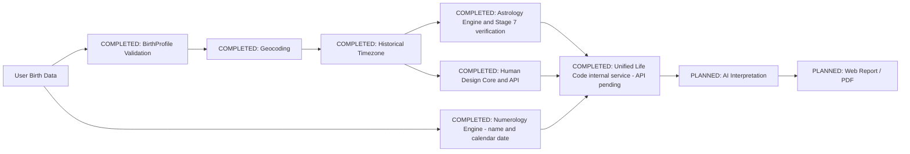

---
tags:
  - memory/architecture
---

# Architecture

Güncel sınırlar ve kaynak haritası için [[04_CURRENT_STATE]]; kararlar için [[05_DECISIONS]];
gerçek HTTP sınırları için [[06_API_CONTRACTS]]. Tarihsel başlangıç notu için
[architecture.md](architecture.md); timezone ayrıntıları için [[timezone]] ([GitHub link](timezone.md));
tasarım ayrıntıları için [[frontend-design]] ([GitHub link](frontend-design.md)).

| Layer | Technology | Status |
| --- | --- | --- |
| Frontend | Next.js, TypeScript, App Router, Tailwind | completed foundation |
| Backend | FastAPI, Python, Pydantic | completed foundation |
| Geocoding | Nominatim through backend service | completed |
| Timezone | timezonefinder, zoneinfo, tzdata | completed |
| Astrology | Swiss Ephemeris 2.10.03 / pyswisseph 2.10.3.2 | Stages 6–7 completed; scope: [[astrology-verification]] |
| Numerology | Pure Python / Pydantic, Pythagorean convention | Stage 8 completed; [[numerology]] |
| Human Design | Swiss/Moshier astronomy + deterministic graph/classification | Stage 9 backend/API completed; [[human-design]] |
| Unified Life Code | Frozen internal envelope + existing typed engine results | Stage 10A completed; Stage 10B API pending; [[life-code]] |
| Database | PostgreSQL | planned |
| AI | provider abstraction, Gemini/OpenAI candidates | planned |
| PDF | shared report JSON source | planned |

Frontend never calls a geocoding provider directly. The timezone layer takes resolved coordinates
and exact local time; the astrology service receives its UTC result and must not repeat
timezone resolution.
Numerology consumes name and calendar birth date directly, with an optional explicit target year;
it has no dependency on coordinates, geocoding or timezone resolution.

Unified Life Code receives already resolved UTC/coordinates alongside the original local calendar
date, name and optional explicit target year. It calls the three existing engines sequentially once,
without recalculation or field loss. Only Numerology receives name/calendar date/target year; only
Astrology receives coordinates. Name is not retained in the result. The frozen outer result preserves
original typed children; Astrology/Numerology children remain mutable (not a deep immutable snapshot).
No new HTTP surface, clock, provider, interpretation or persistence. ADR-016 and [[life-code]] define
the boundary; existing engine conventions and native-state ownership are unchanged.

## Stage 6 Swiss Ephemeris licensing

Stage 6 uses the AGPL route; the Professional License is not used. Copyright and license notices
were verified against the pinned source distribution and preserved in
[THIRD_PARTY_NOTICES](../THIRD_PARTY_NOTICES.md). Calculation conventions: [[astrology]].
