---
tags:
  - memory/core
---

# Roadmap

```mermaid
flowchart LR
  S1[Stage 1 Foundation] --> S2[Stage 2 Form and design] --> S3[Stage 3 API validation]
  S3 --> S35[Stage 3.5 Approach page] --> S4[Stage 4 Geocoding] --> S5[Stage 5 Historical timezone]
  S5 --> S6[Stage 6 Astrology] --> S7[Stage 7 Verification] --> S8[Stage 8 Numerology]
  S8 --> S9[Stage 9 Human Design] --> S10[Stage 10 Unified model] --> S11[Stage 11 AI interpretation] --> S12[Stage 12 Report / PDF]
```

- [x] Stage 1 — Project foundation
- [x] Stage 2 — Frontend design system + birth form
- [x] Stage 3 — Frontend → FastAPI
- [x] Stage 3.5 — Yaklaşım page
- [x] Stage 4 — Geocoding
- [x] Stage 5 — Historical timezone
- [x] Stage 6 — Astrology calculation engine
- [x] Stage 7 — Astrology verification (scope: [[astrology-verification]])
- [x] Stage 8 — Numerology ([[numerology]])
- [ ] Stage 9 — Human Design (9A complete; 9B ready, not started)
  - [x] Stage 9A — Frozen project conventions and scoped official behavioral references (ADR-015).
  - [ ] Stage 9B — Implement and pass the mandatory regression matrix in a separate task.
- [ ] Stage 10 — Unified Life Code model
- [ ] Stage 11 — AI interpretation
- [ ] Stage 12 — Report / PDF

## Platform / Later

- [x] Infrastructure milestone — Dockerized Development Environment

- [ ] PostgreSQL
- [ ] Authentication
- [ ] Analysis history
- [ ] Payments / plans
- [ ] Production deployment
