---
tags:
  - memory/core
---

# Roadmap

```mermaid
flowchart LR
  S1[Stage 1 Foundation] --> S2[Stage 2 Form and design] --> S3[Stage 3 API validation]
  S3 --> S35[Stage 3.5 Approach page] --> S4[Stage 4 Geocoding] --> S5[Stage 5 Historical timezone]
  S5 --> S6[Stage 6 Astrology] --> S7[Stage 7 Verification] --> S8[Stage 8 Numerology]
  S8 --> S9[Stage 9 Human Design] --> S10[Stage 10 Unified model] --> S11[Stage 11 AI interpretation] --> S12[Stage 12 Report / PDF]
```

- [x] Stage 1 — Project foundation
- [x] Stage 2 — Frontend design system + birth form
- [x] Stage 3 — Frontend → FastAPI
- [x] Stage 3.5 — Yaklaşım page
- [x] Stage 4 — Geocoding
- [x] Stage 5 — Historical timezone
- [x] Stage 6 — Astrology calculation engine
- [x] Stage 7 — Astrology verification (scope: [[astrology-verification]])
- [x] Stage 8 — Numerology ([[numerology]])
- [x] Stage 9 — Human Design (9A specification and 9B backend/API complete; no HD frontend)
  - [x] Stage 9A — Frozen project conventions and scoped official behavioral references (ADR-015).
  - [x] Stage 9B — Mechanical core + typed API; mandatory regression matrix passes (789 backend tests).
- [x] Stage 10 — Unified Life Code model and API (no unified result frontend UI)
  - [x] Stage 10A — Deterministic internal model and lossless service aggregation; [[life-code]].
  - [x] Stage 10B — Typed API/admission contract; runtime qualification passes (924 backend tests).
- [ ] Stage 11 — AI interpretation
- [ ] Stage 12 — Report / PDF

## Kamerî Kod research track

- [x] Stage K0 — Methodology, source qualification and scoped project convention freeze (ADR-017;
  [[kameri-code]], [[kameri-source-qualification]]). Docs only; separate from Life Code v1.
- [x] Stage K1 — Implementation, verification and transport for five mechanical methods.
  - [x] Stage K1A — Deterministic internal core; 464 new tests, 1388 full backend pass;
    scoped external evidence in [[kameri-verification]]. ADR-017 unchanged.
  - [x] Stage K1B — Strict public mechanical API with private allowlist projection (ADR-018).
  Readiness is limited to numeric mansion sectors and confirmed-Arabic ebced, alongside tabular
  Hijri, Moon and seasonal planetary hours. No automatic transcription or interpretation readiness.
- [x] Stage K2A — Traditional interpretation source qualification (ADR-019;
  [[kameri-interpretation-qualification]]). Four bounded arithmetic/cultural claims qualified;
  broader mappings research-only/unqualified/deferred. No production KB or AI runtime.
- [x] Stage K2B — Limited production KB complete (ADR-020; [[kameri-knowledge-base]]):
  four immutable claims; Asma reference-only, Hijri month contexts selected deterministically,
  explicit abstention outside months 9/12. No API or AI implementation.
- [ ] Arabic mansion label collation, licensed name suggestions and remaining work-specific research.

Stage 11 knowledge readiness is YES, LIMITED to three Hijri cultural fragments; Asma is not automatic
personal context. Stage 11 remains NOT STARTED; there is no full personalized Kamerî interpretation.

## Platform / Later

- [x] Infrastructure milestone — Dockerized Development Environment

- [ ] PostgreSQL
- [ ] Authentication
- [ ] Analysis history
- [ ] Payments / plans
- [ ] Production deployment
