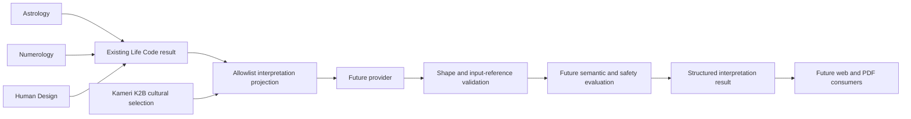

---
tags:
  - memory/ai
---

# AI Interpretation

Stage 11A defines typed input/output contracts, a read-only privacy projection and deterministic
validation. Stage 11 is IN PROGRESS; Stage 11B and Stage 12 NOT STARTED. No SDK, key, provider call,
AI HTTP endpoint, prompt runtime, retry implementation, database or report renderer is introduced.
This is the detailed architecture source; [[09_REPORT_DESIGN]] owns future presentation.

## Ownership

Calculation remains exclusively owned by existing deterministic engines. Interpretation never
computes positions, signs, houses, aspects, numbers, gates, channels, Type, geocoding, timezone,
Hijri conversion or other Kamerî mechanics. The projection consumes an existing `LifeCodeResult`
without invoking the service or engines; report depth never changes the calculation scope.
Existing Life Code and Kamerî response contracts retain `interpretation_present=false`.

## Input and privacy contract

`backend/app/schemas/interpretation.py` defines frozen, strict, extra-forbidden models with tuple
collections. `services/interpretation_projection.py::project_interpretation` explicitly copies
selected values into a detached snapshot; the mutable Astrology/Numerology children of the original
Life Code result are neither modified nor aliased. It does not serialize the original object wholesale.

| Input section | Admitted fields | Deliberately absent |
| --- | --- | --- |
| Astrology | Closed body IDs including nodes/Lilith; sign, nullable house, retrograde; nullable ASC/MC signs; house number/sign; existing aspect body pair/type | Longitudes, degrees, speeds, orb/separation, coordinates, engine/version metadata |
| Numerology | Life path, birthday, expression, nullable soul urge/personality, maturity: value + master flag; nullable personal year | Raw sums/traces, name, calendar birth date, target-year metadata |
| Human Design | Type, Strategy, Authority, Profile label, Definition, defined/undefined centers, active gates, channels | Birth/Design times, longitudes, activations, Julian days, solver diagnostics, native metadata |
| Kamerî | Optional canonical K2B cultural selection with original source citations, limitations and restrictions, or explicit abstention | Name/Arabic/abjad, day/year, coordinates, mansion/hour mechanics, ASMA_NUM_001 |
| Timeline | null only in v1 | Fabricated events, inferred dates or extrapolated cycles |

`schema_version=interpretation-input-v1`. The input contains no depth/provider/config fields,
request IDs, original location/timezone, name/surname or calculation trace. Stable closed literals
prevent engine string fields from becoming a free instruction channel. Invalid copied values become
a static `interpretation_invalid_input`, with no raw validation input or logs.

`include_personal_year=False` is the default. Opt-in copies an already present number only; no target
year or current-year default is calculated. Missing values remain null. Personal year alone is not a
timeline and does not enable that section. Future period data needs a separately reviewed, versioned
deterministic timeline contract before the reserved field can be expanded.

The current Life Code API requires exact resolved time and returns all three engines or fails. It
does not support an unknown-time chart. Interpretation schema permits null engine sections and null
ASC/MC/houses for future independently verified partial inputs; this does not relax Life Code admission
or fabricate a partial result. At least one verified engine section must exist. Upstream trusted code
owns partial-input provenance; an arbitrary client-supplied projection is not authenticated evidence.

Data minimization is not anonymization: combinations of symbolic outputs can still be identifying.
Provider consent, retention and deployment controls must be resolved before external transmission.
No content, exception locals, prompts, input dumps or raw provider responses should be logged by default.
`ValidationError.errors()` can retain input despite hidden printable errors; never expose it directly.

## Plan depths and budgets

`InterpretationDepth`: `free`, `standard`, `premium`. All plans use the same projection policy;
depth limits narration, never deterministic inputs/calculations. First admitted language is `tr`.
Section/reason codes are locale-neutral; another language needs reviewed labels and claim-language
evaluation before extending the language literal. Do not add localized decision logic to engines.

| Depth | Required section IDs, in order | Cross-system / summary | Proposed output-token cap |
| --- | --- | --- | --- |
| FREE | basic_triad, strengths, challenges | Short summary; no cross-system or Kamerî prose | 800 |
| STANDARD | FREE + character, emotional, relationships, career, numerology, human_design | Summary; supported cross-system themes; optional applicable cultural context | 3,200 |
| PREMIUM | STANDARD + life_themes, shadow, repeated_patterns, main_potential, life_lesson, timeline | Deeper comparisons; mandatory at_a_glance and summary | 6,000 |

Token caps are design proposals for 11B, not measured usage, price guarantees or SDK settings.
The implemented schema additionally caps total prose characters at 2,400 / 14,000 / 26,000,
each paragraph at 1,200, three paragraphs per section and five cross-system themes. Tokens and
characters are different budgets. A future Free template fallback must produce the same validated
contract and explicit `provider=template`; no fallback is implemented here.

## Structured output and applicability

`InterpretationContent` is the untrusted provider payload: language, depth, summary, at_a_glance,
ordered sections, cross_system and kameri. Avoid a large duplicate field set by using typed section
IDs. Each section is either a nonempty tuple of `GroundedText` or null content with a typed reason.
Sections outside the selected depth are omitted; duplicate, missing or wrongly ordered IDs fail.
Premium `at_a_glance` is nonempty (UI: **Tek Bakışta**). Every plan requires `summary` (UI:
**Genel Özet ve Sonuç**). These are data contracts, not a Stage 12 renderer.

`GroundedText` holds bounded prose and nonempty `basis` references, e.g.
`astrology.bodies.sun.sign`, `numerology.life_path.value`, `human_design.authority`.
`available_fact_refs` enumerates only present projected values. Referencing missing personal-year,
unknown bodies/houses or private HD timestamps is rejected by `validate_content_for_input`.
The triad section requires supplied Sun, Moon and ASC plus their references. The numerology/HD
sections require their corresponding layer and at least one supporting reference from that layer.

No input means no invention: unavailable triad or engine sections use `missing_input`. Premium
timeline always uses `unsupported_timeline` with null content. Ordinary thematic sections may use
the available systems with references; no system-specific detail may be invented. Input binding
also requires exact requested depth/language. A structurally valid payload alone is not accepted.

Cross-system items contain `kind` and grounded narrative. Kinds are `reinforced_theme`,
`complementary_theme`, `tension`; each item needs references from at least two distinct calculation
systems. `null` means no defensible comparison, not failure; never force agreement or manufacture
a contradiction. There is no deterministic equivalence between the systems. Repeated themes and
differences remain attributed symbolic perspectives, not psychological findings.

`InterpretationResult` wraps validated content with fixed `interpretation-result-v1`, application-owned
metadata and a fixed disclaimer identifier. `prompt_version`, `config_version`, `provider`, `model`
and input schema version allow reproducibility without personal fields or echoed prompt text.
Metadata comes from a trusted configuration registry, never model output or arbitrary user text.
The disclaimer key is localized by a future renderer. Provider/model identifiers must not contain
user data; pattern validation alone cannot establish that fact.

## Kamerî firewall

Caller may supply only a validated, already calculated `HijriMonthContext` separately from Life Code.
Projection calls the existing K2B selector: month 9 has HIJRI_CTX_001/002; month 12 has HIJRI_CTX_003;
the other months abstain. No input means `kameri=null`; no qualified coverage means an explicit
empty/abstained context. These are distinct states. There is no month inferred from birth data here.

`KameriContext` verifies the entire claim and source payload against the bundled snapshot, not only
the IDs. Tampered text, URLs, policy fields, mixed-month selections and ASMA_NUM_001 fail. The optional
Standard/Premium cultural narrative must carry exactly the selected IDs; Free omits cultural prose.
Provider-authored citations are not accepted: a future assembler resolves each ID to the canonical
citations/limitations in the input. Cultural paragraphs are separate from personal cross-system themes.

ASMA_NUM_001 remains reference-only. No abjad-to-Esmâ association, mansion bridge, planetary-hour
advice, Hurûf/zodiac–Esmâ table, mother's-name input or religious prescription enters this contract.
Unqualified/deferred research records are never runtime knowledge. Semantic review must additionally
prevent a model from turning a correctly cited cultural fact into a personal/religious claim.

## Provider boundary, failures and retries

`services/interpretation_models.py::InterpretationProvider` is a small async Python Protocol:
`interpret(input, *, depth, language) -> InterpretationContent`. A future adapter owns SDK-specific
translation; no SDK object enters the domain. The caller validates shape and input binding, performs
semantic/safety checks, and only then attaches trusted metadata/disclaimer to `InterpretationResult`.
No implementation, factory, DI framework, prompt or invocation is provided in 11A.

| Domain code | Meaning / future behavior |
| --- | --- |
| interpretation_invalid_input | Invalid projection/admission; no provider call or retry |
| interpretation_timeout | Deadline exceeded; bounded transient retry if time remains |
| interpretation_unavailable | Transient provider/network failure; static domain failure after budget |
| interpretation_rate_limited | Honor bounded Retry-After/backoff within total deadline |
| interpretation_invalid_response | Malformed JSON or invalid input linkage/content; at most one correction |
| interpretation_schema_mismatch | Wrong schema/types/depth/language; at most one correction |
| interpretation_refused | Safety refusal; no automatic retry to evade refusal |

Proposed 11B policy: at most three total attempts (initial + two), including at most one corrective
attempt, with a total 60-second deadline; exponential backoff starting at one second, capped at five,
with jitter. A Retry-After beyond the remaining budget returns rate_limited. Cancellation stops work;
timeouts and corrective retries may cost tokens even when the result is discarded. Review actual
provider latency before freezing operational settings. No retry code is implemented now.

Errors use static code/message pairs. A future adapter must suppress raw SDK exception chaining and
never return provider bodies, rejected JSON, request IDs or diagnostic text to users. Programming errors
remain visible to developers via sanitized operational reporting, not fabricated successful content.
Operational input_tokens/output_tokens/latency_ms and allowlisted provider/model/version may be measured
outside the public result; do not log payloads. No metrics collector or provider usage claim exists yet.

## Claim discipline and input security

Use attributed, non-certain wording: “bu sistemde”, “sembolik olarak”, “şu temayla ilişkilendirilir”.
No medical/mental-health diagnosis, legal/financial directive, personal religious ruling or definite
future prediction. Relationship/career sections offer symbolic reflection, not commands or forecasts.

11B must separate trusted SYSTEM INSTRUCTIONS from structured JSON DATA. Even engine/KB strings are
data, never instructions; no user name/location goes into instruction text. Closed enums and canonical
KB equality reduce injection surface but do not prove model obedience. Do not interpolate a whole Life
Code object, a raw user prompt, research prose or an exception into system instructions or corrective
feedback. Correction feedback should contain safe codes/paths only, not echoed malicious responses.

Shape validation, evidence references and a disclaimer cannot detect all unsafe or fabricated prose.
11A does not claim a semantic safety filter. Stage 11B needs a reviewed prompt/config, consent and
retention design, bounded generation, semantic factuality/claim-discipline evaluation, rejection paths,
and synthetic adversarial tests before any provider response can be delivered. Medical claims with valid
JSON must still be rejected there. Provider structured-output dialect compatibility is UNVERIFIED until
an adapter is tested; use this Pydantic contract as the canonical local validator.

## Verification and next stage

`test_interpretation_contracts.py` covers explicit field privacy, metadata injection rejection,
read-only deterministic snapshots, no calculation/network calls during projection, nullable inputs,
personal-year opt-in, depth/section/length enforcement, input-grounded references, cross-system kinds,
canonical Kamerî selection/tampering and static errors. Synthetic data only; these tests validate
contracts, not AI quality or new astronomical goldens. Full backend and pip check are required.

Stage 11B should implement one explicitly selected provider adapter and the validation/semantic
pipeline under reviewed operational policy. No provider selection or implementation is implied by 11A.
