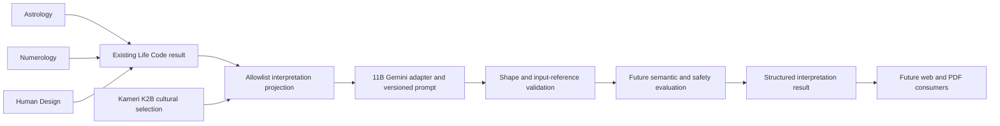

---
tags:
  - memory/ai
---

# AI Interpretation

Stage 11A defines typed input/output contracts, a read-only privacy projection and deterministic
validation. Stage 11B implements the Gemini adapter, versioned prompt and bounded internal runtime.
11A/11B COMPLETE; Stage 11 IN PROGRESS; 11C NEXT; Stage 12 NOT STARTED. No public AI HTTP endpoint,
live API qualification, database or report renderer is introduced.
This is the detailed architecture source; [[09_REPORT_DESIGN]] owns future presentation.

## Ownership

Calculation remains exclusively owned by existing deterministic engines. Interpretation never
computes positions, signs, houses, aspects, numbers, gates, channels, Type, geocoding, timezone,
Hijri conversion or other Kamerî mechanics. The projection consumes an existing `LifeCodeResult`
without invoking the service or engines; report depth never changes the calculation scope.
Existing Life Code and Kamerî response contracts retain `interpretation_present=false`.

## Input and privacy contract

`backend/app/schemas/interpretation.py` defines frozen, strict, extra-forbidden models with tuple
collections. `services/interpretation_projection.py::project_interpretation` explicitly copies
selected values into a detached snapshot; the mutable Astrology/Numerology children of the original
Life Code result are neither modified nor aliased. It does not serialize the original object wholesale.

| Input section | Admitted fields | Deliberately absent |
| --- | --- | --- |
| Astrology | Closed body IDs including nodes/Lilith; sign, nullable house, retrograde; nullable ASC/MC signs; house number/sign; existing aspect body pair/type | Longitudes, degrees, speeds, orb/separation, coordinates, engine/version metadata |
| Numerology | Life path, birthday, expression, nullable soul urge/personality, maturity: value + master flag; nullable personal year | Raw sums/traces, name, calendar birth date, target-year metadata |
| Human Design | Type, Strategy, Authority, Profile label, Definition, defined/undefined centers, active gates, channels | Birth/Design times, longitudes, activations, Julian days, solver diagnostics, native metadata |
| Kamerî | Optional canonical K2B cultural selection with original source citations, limitations and restrictions, or explicit abstention | Name/Arabic/abjad, day/year, coordinates, mansion/hour mechanics, ASMA_NUM_001 |
| Timeline | null only in v1 | Fabricated events, inferred dates or extrapolated cycles |

`schema_version=interpretation-input-v1`. The input contains no depth/provider/config fields,
request IDs, original location/timezone, name/surname or calculation trace. Stable closed literals
prevent engine string fields from becoming a free instruction channel. Invalid copied values become
a static `interpretation_invalid_input`, with no raw validation input or logs.

`include_personal_year=False` is the default. Opt-in copies an already present number only; no target
year or current-year default is calculated. Missing values remain null. Personal year alone is not a
timeline and does not enable that section. Future period data needs a separately reviewed, versioned
deterministic timeline contract before the reserved field can be expanded.

The current Life Code API requires exact resolved time and returns all three engines or fails. It
does not support an unknown-time chart. Interpretation schema permits null engine sections and null
ASC/MC/houses for future independently verified partial inputs; this does not relax Life Code admission
or fabricate a partial result. At least one verified engine section must exist. Upstream trusted code
owns partial-input provenance; an arbitrary client-supplied projection is not authenticated evidence.

Data minimization is not anonymization: combinations of symbolic outputs can still be identifying.
Provider consent, retention and deployment controls must be resolved before external transmission.
No content, exception locals, prompts, input dumps or raw provider responses should be logged by default.
`ValidationError.errors()` can retain input despite hidden printable errors; never expose it directly.

## Plan depths and budgets

`InterpretationDepth`: `free`, `standard`, `premium`. All plans use the same projection policy;
depth limits narration, never deterministic inputs/calculations. First admitted language is `tr`.
Section/reason codes are locale-neutral; another language needs reviewed labels and claim-language
evaluation before extending the language literal. Do not add localized decision logic to engines.

| Depth | Required section IDs, in order | Cross-system / summary | Proposed output-token cap |
| --- | --- | --- | --- |
| FREE | basic_triad, strengths, challenges | Short summary; no cross-system or Kamerî prose | 800 |
| STANDARD | FREE + character, emotional, relationships, career, numerology, human_design | Summary; supported cross-system themes; optional applicable cultural context | 3,200 |
| PREMIUM | STANDARD + life_themes, shadow, repeated_patterns, main_potential, life_lesson, timeline | Deeper comparisons; mandatory at_a_glance and summary | 6,000 |

11B uses these output-token caps; they are not measured usage or price/quality guarantees.
The implemented schema additionally caps total prose characters at 2,400 / 14,000 / 26,000,
each paragraph at 1,200, three paragraphs per section and five cross-system themes. Tokens and
characters are different budgets. A future Free template fallback must produce the same validated
contract and explicit `provider=template`; no fallback is implemented here.

## Structured output and applicability

`InterpretationContent` is the untrusted provider payload: language, depth, summary, at_a_glance,
ordered sections, cross_system and kameri. Avoid a large duplicate field set by using typed section
IDs. Each section is either a nonempty tuple of `GroundedText` or null content with a typed reason.
Sections outside the selected depth are omitted; duplicate, missing or wrongly ordered IDs fail.
Premium `at_a_glance` is nonempty (UI: **Tek Bakışta**). Every plan requires `summary` (UI:
**Genel Özet ve Sonuç**). These are data contracts, not a Stage 12 renderer.

`GroundedText` holds bounded prose and nonempty `basis` references, e.g.
`astrology.bodies.sun.sign`, `numerology.life_path.value`, `human_design.authority`.
`available_fact_refs` enumerates only present projected values. Referencing missing personal-year,
unknown bodies/houses or private HD timestamps is rejected by `validate_content_for_input`.
The triad section requires supplied Sun, Moon and ASC plus their references. The numerology/HD
sections require their corresponding layer and at least one supporting reference from that layer.

No input means no invention: unavailable triad or engine sections use `missing_input`. Premium
timeline always uses `unsupported_timeline` with null content. Ordinary thematic sections may use
the available systems with references; no system-specific detail may be invented. Input binding
also requires exact requested depth/language. A structurally valid payload alone is not accepted.

Cross-system items contain `kind` and grounded narrative. Kinds are `reinforced_theme`,
`complementary_theme`, `tension`; each item needs references from at least two distinct calculation
systems. `null` means no defensible comparison, not failure; never force agreement or manufacture
a contradiction. There is no deterministic equivalence between the systems. Repeated themes and
differences remain attributed symbolic perspectives, not psychological findings.

`InterpretationResult` wraps validated content with fixed `interpretation-result-v1`, application-owned
metadata and a fixed disclaimer identifier. `prompt_version`, `config_version`, `provider`, `model`
and input schema version allow reproducibility without personal fields or echoed prompt text.
Metadata comes from a trusted configuration registry, never model output or arbitrary user text.
The disclaimer key is localized by a future renderer. Provider/model identifiers must not contain
user data; pattern validation alone cannot establish that fact.

## Kamerî firewall

Caller may supply only a validated, already calculated `HijriMonthContext` separately from Life Code.
Projection calls the existing K2B selector: month 9 has HIJRI_CTX_001/002; month 12 has HIJRI_CTX_003;
the other months abstain. No input means `kameri=null`; no qualified coverage means an explicit
empty/abstained context. These are distinct states. There is no month inferred from birth data here.

`KameriContext` verifies the entire claim and source payload against the bundled snapshot, not only
the IDs. Tampered text, URLs, policy fields, mixed-month selections and ASMA_NUM_001 fail. The optional
Standard/Premium cultural narrative must carry exactly the selected IDs; Free omits cultural prose.
Provider-authored citations are not accepted: a future assembler resolves each ID to the canonical
citations/limitations in the input. Cultural paragraphs are separate from personal cross-system themes.

ASMA_NUM_001 remains reference-only. No abjad-to-Esmâ association, mansion bridge, planetary-hour
advice, Hurûf/zodiac–Esmâ table, mother's-name input or religious prescription enters this contract.
Unqualified/deferred research records are never runtime knowledge. Semantic review must additionally
prevent a model from turning a correctly cited cultural fact into a personal/religious claim.

## Provider boundary, failures and retries

`services/interpretation_models.py::InterpretationProvider` is a small async Python Protocol:
`interpret(input, *, depth, language) -> InterpretationContent`. The Gemini adapter owns SDK-specific
translation; no SDK object enters the domain. The service validates shape and input binding, then
attaches trusted metadata/disclaimer to `InterpretationResult`. Structural checks are not a general
prose-safety classifier. 11B adds construction and invocation without changing the Protocol.

| Domain code | Meaning / future behavior |
| --- | --- |
| interpretation_invalid_input | Invalid projection/admission; no provider call or retry |
| interpretation_timeout | Deadline exceeded; bounded transient retry if time remains |
| interpretation_unavailable | Transient provider/network failure; static domain failure after budget |
| interpretation_rate_limited | Honor bounded Retry-After/backoff within total deadline |
| interpretation_invalid_response | Malformed JSON or invalid input linkage/content; at most one correction |
| interpretation_schema_mismatch | Wrong schema/types/depth/language; at most one correction |
| interpretation_refusal | Safety refusal; no automatic retry to evade refusal |
| interpretation_configuration_error | Missing key/model or unsupported provider; no fallback |

Implemented 11B policy: at most three total attempts (initial + AI_MAX_RETRIES 0..2), including at most
one corrective request. A shared deadline defaults to 60 seconds (configurable 1..120). Exponential
backoff is 1, 2 seconds, capped at 5; deliberately deterministic, without jitter in this initial runtime.
Numeric/HTTP-date Retry-After is honored when exposed by the SDK. A server delay above 5 seconds or
beyond the remaining budget ends with the original static failure instead of retrying too early.
SDK retries are explicitly disabled (attempts=1), as is automatic function calling. Timeout, HTTP 408,
429, 500/502/503/504 and transport failures are retryable within the shared budget; other HTTP errors
are not. Refusal, invalid admission and configuration errors never retry. Cancellation propagates.
The 11A internal spelling interpretation_refused remains a compatibility alias; new code emits
interpretation_refusal. Timeouts/retries may still incur provider costs for discarded results.

Errors use static code/message pairs. The adapter suppresses raw SDK exception chaining and
never return provider bodies, rejected JSON, request IDs or diagnostic text to users. Programming errors
remain visible to developers via sanitized operational reporting, not fabricated successful content.
Operational input_tokens/output_tokens/latency_ms and allowlisted provider/model/version may be measured
outside the public result; do not log payloads. No metrics collector or provider usage claim exists yet.

## Claim discipline and input security

Use attributed, non-certain wording: “bu sistemde”, “sembolik olarak”, “şu temayla ilişkilendirilir”.
No medical/mental-health diagnosis, legal/financial directive, personal religious ruling or definite
future prediction. Relationship/career sections offer symbolic reflection, not commands or forecasts.

11B separates trusted SYSTEM INSTRUCTIONS from structured JSON DATA. Even engine/KB strings are
data, never instructions; no user name/location goes into instruction text. Closed enums and canonical
KB equality reduce injection surface but do not prove model obedience. Do not interpolate a whole Life
Code object, a raw user prompt, research prose or an exception into system instructions or corrective
feedback. Correction feedback should contain safe codes/paths only, not echoed malicious responses.

Shape validation, evidence references and a disclaimer cannot detect all unsafe or fabricated prose.
11B implements invariant prompts, provider-refusal handling, bounded generation and structural rejection,
not arbitrary regex NLP censorship or a proven semantic safety classifier. A correctly referenced text
can still contain a diagnosis, invented meaning or personal religious claim. Before public delivery,
11C must resolve consent/retention and a reviewed fail-closed safety/admission policy, with adversarial
live-model evaluation; these are NOT established by offline mocks. SDK serialization is tested, but
live model/dialect acceptance, Turkish prose quality and semantic safety remain UNVERIFIED.

## Verification and next stage

`test_interpretation_contracts.py` covers explicit field privacy, metadata injection rejection,
read-only deterministic snapshots, no calculation/network calls during projection, nullable inputs,
personal-year opt-in, depth/section/length enforcement, input-grounded references, cross-system kinds,
canonical Kamerî selection/tampering and static errors. Synthetic data only; these tests validate
contracts, not AI quality or new astronomical goldens. Full backend and pip check are required.

## Stage 11B runtime qualification

`services/providers/gemini_interpretation.py` implements the existing async Protocol;
`interpretation_service.py` supplies an injectable provider-neutral service and explicit factory.
Only AI_PROVIDER=gemini is supported now, without fallback; future adapters can use the same Protocol.
Gemini is the first, not permanently exclusive provider (ADR-022). No routes import SDK objects.
The factory is lazy: calculation APIs start without a Gemini model or key. Each interpretation owns
its client lifetime, closes sync/async transports and has independent retries; no global mutable client.

### SDK and configuration

Pinned official [google-genai 2.25.0](https://pypi.org/project/google-genai/2.25.0/), Apache-2.0,
Python >=3.10; tested with project Python 3.11. See THIRD_PARTY_NOTICES.md for dependency review.
Backend Settings/.env.example: AI_PROVIDER=gemini, GEMINI_API_KEY empty SecretStr,
GEMINI_MODEL empty (operator chooses and qualifies a supported model),
AI_REQUEST_TIMEOUT_SECONDS=60, AI_MAX_RETRIES=2. Invalid range fails settings admission; an unsupported
provider, empty model/key or invalid model identifier gives a static configuration error at the factory.
Never commit actual keys; no NEXT_PUBLIC fields. Existing Compose reads .env.example, so live operator
configuration needs a private environment override; do not put a key into the example file.
The adapter explicitly chooses the Developer API endpoint and v1beta, disables ambient proxy selection,
and passes its configured key rather than accepting another GOOGLE_* provider/key selection.

### Native JSON and final validation

The pinned SDK's async models.generate_content receives one user Content containing structured JSON
InterpretationInput and the derived available-fact-reference list, separately from system_instruction.
No chat history, user prose, calculation request, tools, files, browsing or cache persistence is used.
Native response_mime_type=application/json + response_json_schema are set. The compact schema derives
from InterpretationContent (not the application-owned metadata envelope): local references are inlined,
const becomes enum, nullable alternatives become type arrays, presentation/default/string pattern/length
keywords are omitted. Final Pydantic validation retains ALL canonical constraints; the canonical model
was not weakened. [Google's structured-output limits](https://ai.google.dev/gemini-api/docs/generate-content/structured-output?hl=en)
explain the supported subset and complexity limit. The generate-content surface remains supported by
the pinned SDK although Google's current docs also promote Interactions; this task adds no conversation
storage/API migration. No claim that every configurable model supports this schema.

Only one complete STOP text candidate is accepted; prompt/candidate safety blocks are static refusals.
Truncation, missing candidates or non-text/tool parts fail. Thought parts are ignored, never logged.
Generated JSON is capped at 200 KB, duplicate keys/nonfinite constants rejected, then validated with
InterpretationContent.model_validate_json and validate_content_for_input. The service independently
revalidates content/binding and InterpretationResult after attaching trusted provider/model/prompt/
config/schema versions. No provider-authored metadata or invented token/latency measurements.

`interpretation_prompts.py` holds life-code-interpretation-v1 and gemini-interpretation-v1 config.
Shared immutable core/depth policies require no calculation, altered facts, invented systems/timeline,
professional prescriptions, diagnoses or religious claims. Premium Tek Bakışta and summary remain
mandatory. Kamerî accepts only actual canonical HIJRI_CTX_001/002/003 input IDs, never Asma or a
mansion/personality bridge. Output claim IDs cannot license forbidden prose; that residual risk remains.

At most one repair replaces the whole invalid content, using the same structured input plus a generic
instruction. Neither failed text nor a Pydantic trace is echoed. A second content failure becomes
schema_mismatch; a transport/refusal on the correction retains its static error without another call.
The repair shares the total attempt/deadline budget. With retries=0, malformed JSON is invalid_response
and a valid JSON shape mismatch is schema_mismatch. Malformed SDK envelopes are invalid_response,
not successful content. No manual field guessing, successful partial report or template fallback.

### Privacy, tests and remaining delivery gate

The application logs no inputs, outputs, prompts, keys or raw exceptions. Hidden validation errors and
disabled serialization warnings protect tampered-input paths. Pinned-SDK HTTP-fake tests check DEBUG
logs for synthetic sentinels; no telemetry is fabricated. Do not enable external HTTP body/header
tracing, exception-local capture, SDK replay recording or report logging in deployment.
Provider service terms, data retention and consent need explicit operator review before real data use;
symbolic minimization is not anonymity. No live call was run and no actual key is required by tests.

`test_gemini_interpretation.py` exercises fake-client and real-SDK/HTTP-fake boundaries, all depths,
configuration/model selection, canonical Kamerî, missing systems/timeline, schema/input binding,
refusals, malformed JSON, bounded retries/repair/Retry-After, deadlines/cancellation, client cleanup,
static errors and metadata. `fixtures/interpretation_cases.json` holds eight synthetic symbolic cases,
not real-person birth data or golden prose. Existing 11A privacy/projection tests remain mandatory.
Full pytest, pip check, HD read-only audit and Kamerî evidence must pass before commit.

Next scope is 11C only after separate authorization: typed FastAPI transport/admission, private error
mapping, explicit consent/retention and safety qualification, dependency overrides, rate/cost controls
and endpoint tests. Do not accept arbitrary caller-supplied symbols as verified calculation evidence.
11B creates no public interpretation endpoint; Stage 12 and frontend remain untouched.
